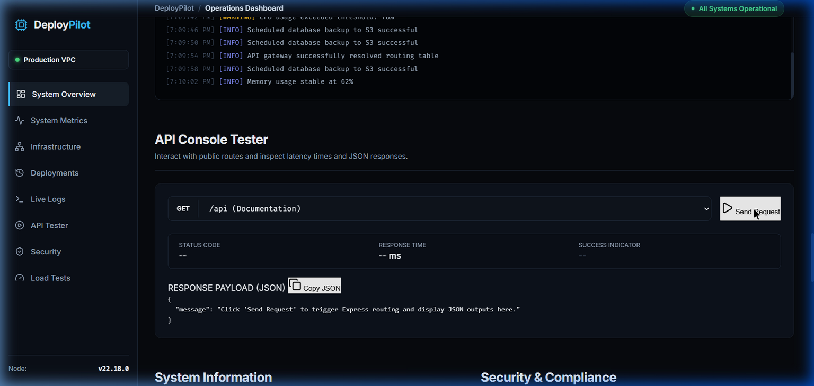

# DeployPilot 🚀 — Cloud Operations & DevOps Dashboard

DeployPilot is a production-grade, portfolio-quality DevOps telemetry operations console. It visualizes real-time server performance metrics, monitors background service clusters, captures live application run logs, and runs REST API tests. 

Designed for high durability and performance, DeployPilot is prepared for AWS EC2 hosting and containerized environments (Docker), featuring helmet protection, response compression, CORS configuration, and clean graceful process exits.

---

## Key Features

- **Real-time Server Telemetry**: Dynamic plots powered by **Chart.js** displaying fluctuating lines for CPU load, Memory allocations, disk space parameters, network bandwidth throughput, requests per minute (RPM), and latency rates.
- **Interactive Architecture Blueprint**: A structural cloud diagram detailing request hops. Hover states trigger contextual explanations.
- **Simulated Terminal Logging**: Captures runtime entries (success, warnings, and system alarms) with level-specific color highlights.
- **REST Console Tester**: Executes test queries to public routes (e.g. `/health`, `/time`) and calculates response timing in milliseconds.
- **Production Infrastructure Preparedness**:
  - Express.js backend refactored under `src/` directory.
  - Security headers enforced via `Helmet` middleware.
  - Comma-separated CORS allowed origin lists.
  - Response payload size reduced using Gzip `compression`.
  - Application logging configured through `Morgan`.
  - Node process SIGINT/SIGTERM handlers enabling graceful server shutdowns.
  - Environment variable separation with `dotenv` variables.
  - Multi-stage `Dockerfile` and `.dockerignore` filters.

---

## Dashboard Interface



---

## Directory Architecture

The repository uses a modular structure separating configurations, routes, middlewares, and views:

```
├── Dockerfile                  # Multi-stage Docker builder and runner configurations
├── .dockerignore               # File exclusions for Docker contexts
├── .gitignore                  # Excludes .env credentials and node modules
├── .env                        # Local environment parameters (non-committed)
├── .env.example                # Shared environment variable templates
├── package.json                # Project dependencies and script maps
├── README.md                   # System documentation
├── src/                        # Express application source code
│   ├── server.js               # Application launcher with process shutdown triggers
│   ├── app.js                  # App configurations, middleware stacks, and routers
│   ├── config/
│   │   └── environment.js      # Loads .env files and exports config mappings
│   ├── middleware/
│   │   ├── error.js            # Standardized 404 and 500 error responders
│   │   ├── logging.js          # Configures Morgan log modes (dev / combined)
│   │   └── validation.js       # Basic query and body argument validates
│   └── routes/
│       ├── api.js              # REST endpoints for charts, logs, and tester console
│       └── index.js            # Router compiler
└── public/                     # Static frontend dashboard assets
    ├── index.html              # HTML structure with CSS layout bindings
    ├── css/
    │   └── style.css           # Premium Slate dashboard design theme
    ├── js/
    │   └── app.js              # Polling controls, tooltips, and tester runs
    └── images/
        └── dashboard_screenshot.png
```

---

## API Documentation

### 1. Health Status check
- **Route**: `GET /health`
- **Purpose**: Health check status suitable for AWS Application Load Balancers (ALB) and target groups.
- **Response sample (200 OK)**:
  ```json
  {
    "status": "Healthy",
    "uptime": 145,
    "timestamp": "2026-07-02T13:38:19.249Z",
    "services": {
      "ec2_instance": "running",
      "s3_bucket": "connected",
      "github_actions_webhook": "active"
    }
  }
  ```

### 2. Synced server UTC clock
- **Route**: `GET /time`
- **Response sample (200 OK)**:
  ```json
  {
    "time": "13:38:19 UTC",
    "epoch": 1782999499249,
    "formatted": "Thu, 02 Jul 2026 13:38:19 GMT"
  }
  ```

### 3. Server Specifications Metadata
- **Route**: `GET /api/system-info`
- **Response sample (200 OK)**:
  ```json
  {
    "node_version": "v22.18.0",
    "express_version": "4.19.2",
    "server_time": "13:38:19 UTC",
    "timezone": "UTC",
    "platform": "linux",
    "architecture": "x64",
    "process_id": 8421,
    "environment": "production",
    "build_number": "20260702.48",
    "deployment_version": "v1.0.0 Stable"
  }
  ```

### 4. Telemetry metrics stream
- **Route**: `GET /api/metrics`
- **Response sample (200 OK)**:
  ```json
  {
    "cpu": 34,
    "memory": 61,
    "disk": 42.4,
    "active_connections": 82,
    "response_time_ms": 18,
    "requests_per_minute": 521,
    "network_in_mbps": "3.12",
    "network_out_mbps": "9.45",
    "uptime_seconds": 145
  }
  ```

---

## Local Getting Started

### 1. Installation
Ensure Node.js v18 or later is installed. Clone the repository and install project packages:
```bash
npm install
```

### 2. Configure environment
Duplicate `.env.example` and rename to `.env`. Update parameters to match local/target ports:
```bash
cp .env.example .env
```

### 3. Run application
- **Development mode** (auto-watches file changes):
  ```bash
  npm run dev
  ```
- **Production mode**:
  ```bash
  npm start
  ```

Access the dashboard by navigating to `http://localhost:3000`.

---

## AWS Deployment Walkthrough

### Option A: Running with Docker (Recommended)

1. **Build image**:
   ```bash
   docker build -t deploypilot:latest .
   ```
2. **Run container**:
   ```bash
   docker run -d \
     -p 3000:3000 \
     --env-file .env \
     --name deploypilot-app \
     --restart unless-stopped \
     deploypilot:latest
   ```

### Option B: Deploying directly on AWS EC2

1. **SSH into EC2 VM**:
   ```bash
   ssh -i deploy-key.pem ubuntu@your-ec2-ip
   ```
2. **Install Node.js & PM2**:
   ```bash
   curl -fsSL https://deb.nodesource.com/setup_20.x | sudo -E bash -
   sudo apt-get install -y nodejs
   sudo npm install -g pm2
   ```
3. **Pull repo and run process**:
   ```bash
   git clone https://github.com/your-username/DeployPilot.git
   cd DeployPilot
   npm install --only=production
   cp .env.example .env
   # Edit env parameters (e.g. PORT)
   nano .env
   
   # Start background PM2 process clusters
   pm2 start src/server.js --name "deploypilot"
   pm2 startup
   pm2 save
   ```

---

## CI/CD Pipeline (GitHub Actions integration)

Automate Deployments on EC2 using workflow config triggers:

```yaml
name: DeployPilot EC2 CI/CD

on:
  push:
    branches: [ main ]

jobs:
  deploy:
    runs-on: ubuntu-latest
    steps:
      - name: Checkout Source Code
        uses: actions/checkout@v4

      - name: Deploy to AWS EC2 Instance via SSH
        uses: appleboy/ssh-action@master
        with:
          host: ${{ secrets.EC2_HOST }}
          username: ubuntu
          key: ${{ secrets.EC2_SSH_KEY }}
          script: |
            cd /var/www/DeployPilot
            git pull origin main
            npm install --only=production
            pm2 reload deploypilot
```